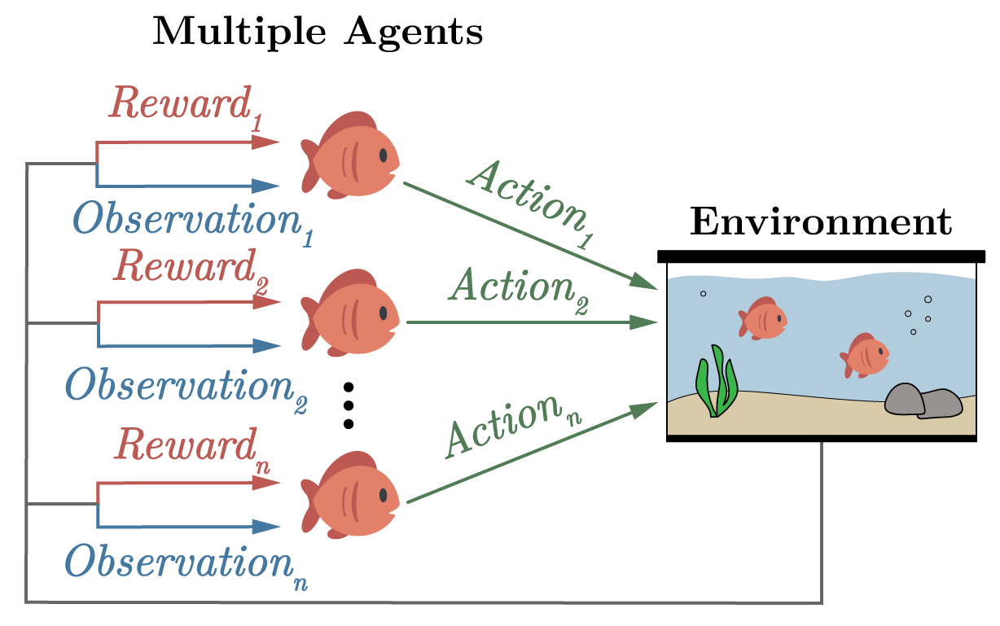
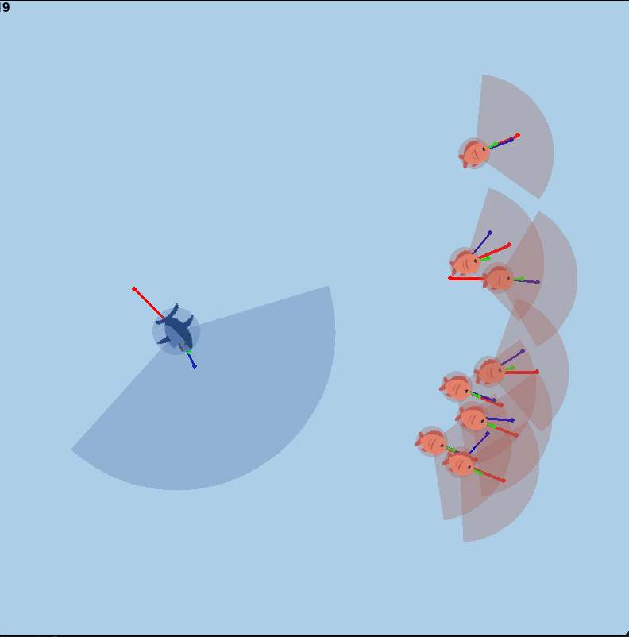

# Aquarium Environment

A Comprehensive Framework for Exploring Predator-Prey Dynamics through Multi-Agent Reinforcement Learning Algorithms using the pettingzoo interface.



## Install

```bash
pip install marl-aquarium
```

## Example

```python
from marl_aquarium import aquarium_v0

env = aquarium_v0.env()
env.reset(seed=42)

for agent in env.agent_iter():
    observation, reward, termination, truncation, info = env.last()

    if termination or truncation:
        action = None
    else:
        # this is where you would insert your policy
        action = env.action_space(agent).sample()

    env.step(action)
    env.render()
env.close()
```



## Customize the environment

| Parameter                   | Description                                                                             | Default Value |
| --------------------------- | --------------------------------------------------------------------------------------- | ------------- |
| `render_mode`               | The mode of rendering. Options include "human" for on-screen rendering and "rgb_array". | `"human"`     |
| `observable_walls`          | Number of observable walls for the agents.                                              | `2`           |
| `width`                     | The width of the environment window.                                                    | `800`         |
| `height`                    | The height of the environment window.                                                   | `800`         |
| `caption`                   | The caption of the environment window.                                                  | `"Aquarium"`  |
| `fps`                       | Frames per second, controlling the speed of simulation.                                 | `60`          |
| `max_time_steps`            | Maximum number of time steps per episode.                                               | `3000`        |
| `action_count`              | Number of possible actions an agent can take.                                           | `16`          |
| `predator_count`            | Number of predators in the environment.                                                 | `1`           |
| `prey_count`                | Number of prey in the environment.                                                      | `16`          |
| `predator_observe_count`    | Number of predators that can be observed by an agent.                                   | `1`           |
| `prey_observe_count`        | Number of prey that can be observed by an agent.                                        | `3`           |
| `draw_force_vectors`        | Whether to draw force vectors for debugging.                                            | `False`       |
| `draw_action_vectors`       | Whether to draw action vectors for debugging.                                           | `False`       |
| `draw_view_cones`           | Whether to draw view cones for debugging.                                               | `False`       |
| `draw_hit_boxes`            | Whether to draw hit boxes for debugging.                                                | `False`       |
| `draw_death_circles`        | Whether to draw death circles for debugging.                                            | `False`       |
| `fov_enabled`               | Whether field of view is enabled for agents.                                            | `True`        |
| `keep_prey_count_constant`  | Whether to keep the prey count constant throughout the simulation.                      | `True`        |
| `prey_radius`               | Radius of prey entities.                                                                | `20`          |
| `prey_max_acceleration`     | Maximum acceleration of prey entities.                                                  | `1.0`         |
| `prey_max_velocity`         | Maximum velocity of prey entities.                                                      | `4.0`         |
| `prey_view_distance`        | View distance of prey entities.                                                         | `100`         |
| `prey_replication_age`      | Age at which prey entities replicate.                                                   | `200`         |
| `prey_max_steer_force`      | Maximum steering force of prey entities.                                                | `0.6`         |
| `prey_fov`                  | Field of view for prey entities.                                                        | `120`         |
| `prey_reward`               | Reward for prey survival per time step.                                                 | `1`           |
| `prey_punishment`           | Punishment for prey being caught.                                                       | `1000`        |
| `max_prey_count`            | Maximum number of prey entities in the environment.                                     | `20`          |
| `predator_max_acceleration` | Maximum acceleration of predator entities.                                              | `0.6`         |
| `predator_radius`           | Radius of predator entities.                                                            | `30`          |
| `predator_max_velocity`     | Maximum velocity of predator entities.                                                  | `5.0`         |
| `predator_view_distance`    | View distance of predator entities.                                                     | `200`         |
| `predator_max_steer_force`  | Maximum steering force of predator entities.                                            | `0.6`         |
| `predator_max_age`          | Maximum age of predator entities.                                                       | `3000`        |
| `predator_fov`              | Field of view for predator entities.                                                    | `150`         |
| `predator_reward`           | Reward for predator catching prey.                                                      | `10`          |
| `catch_radius`              | Radius within which predators can catch prey.                                           | `100`         |
| `procreate`                 | Whether entities can procreate within the environment.                                  | `False`       |

```python
env = aquarium_v0.env(
    draw_force_vectors=True,
    draw_action_vectors=True,
    draw_view_cones=True,
    draw_hit_boxes=True,
    draw_death_circles=True,
)
```
